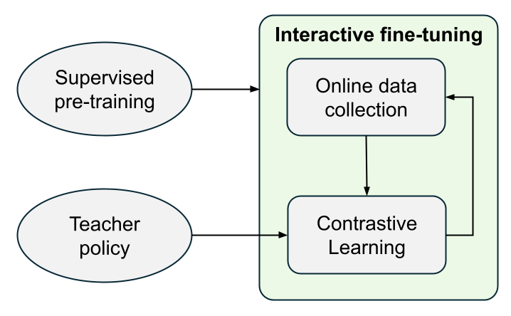
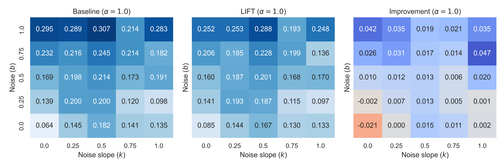

# LIFT: contrastive Learning neuromotor Interface From Teacher
<!-- Training human-computer interfaces is challenging because ground-truth data about human intent is hard to obtain and interfaces are often subject to distributional shifts. To loosen the assumption of having access to intent labels, we propose an interactive contrastive fine-tuning method. For that, we formulate pseudo-labeling as a Bayesian inference problem guided by an optimal teacher policy. -->

When training human-computer interfaces (HCI) we face significant challenges due to the variability in user behavior and the need for large amounts of labeled training data.
To address these limitations and towards implicitly adapting to streaming user behavior without intent labels, we propose LIFT, an interactive contrastive fine-tuning method that learns to adapt to user behavior in real-time. Our approach formulates pseudo-labeling as a Bayesian inference problem, guided by an optimal "teacher" policy that serves as a prior.

The method follows an interactive learning scheme, where we first pretrain a general policy and then iteratively adapted to a new user.



We validate LIFT in a simulated robotic control task, demonstrating its effectiveness in aligning with user intent even when the teacher prior is misspecified. Our results show that LIFT outperforms a baseline method in most cases, except when the user's behavior is very similar to the teacher's.



Check out our [paper TODO]() for more details.

# Training
Create a conda environment and install the required packages
```
conda create -n lift python=3.11
conda activate lift
pip install -r requirements.txt
```
In order to train an EMG decoder, we first need to train a teacher that predicts ideal actions and at the same time simulates users with different beliefs. We train this meta teacher by running
```
python scripts/train_teacher_meta.py
```
> You might want to run `export PYTHONPATH=/path/to/LIFT` if files such as configs.py are not found.

Further, we need to pretrain the decoder on a dataset, such that it performs decently in online interactions from beginning on
```
python scripts/pretrain_mi.py
```
Now all necessary models for simulating interactive HCI training are present. There are two main ways to train a decoder: in one session or in several iterative sessions. For one session run
```
python scripts/train_mi.py
```
or for several sessions run
```
python scripts/train_mi_iter.py
```
results will be automatically uploaded to weights and biases. If this is not desired if can be turned off in [configs.py](./configs.py).


# Acknowledgment
If you make use of this work in a publication, cite us as
```
@inproceedings{lift2024,
  author    = {Freitag, Kilian and Wei, Ran},
  title     = {Contrastive Learning Neuromotor Interface From Teacher},
  year      = {2024},
  maintitle = {Conference on Neural Information Processing Systems},
  booktitle = {Workshop on Pluralistic Alignment},
}
```